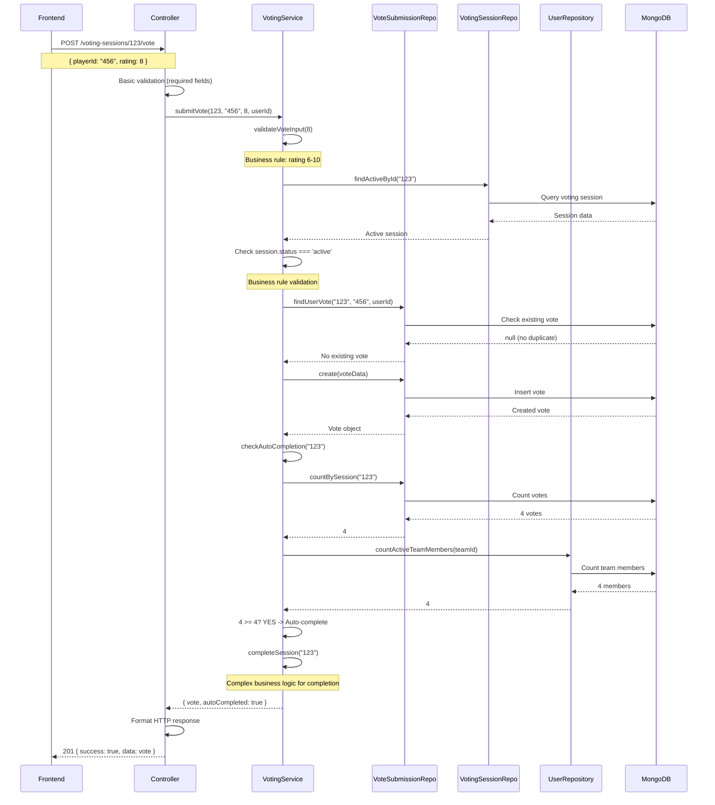

# 🏗️ SYSTEM ARCHITECTURE GUIDE - PAGELLE FC

## 📋 **OVERVIEW**

**Data Creazione:** 18 Dicembre 2025  
**Versione Sistema:** Post Week2 Refactor  
**Architettura:** Service Layer + Repository Pattern  

Questa guida spiega **come funziona tutto il sistema Pagelle FC** dopo il cambio di architettura della Week2. Non è solo un refactor - è una **rivoluzione architetturale** che trasforma il sistema da monolitico a enterprise-grade.

---

## 🎯 **FILOSOFIA ARCHITETTURALE**

### **PRINCIPIO FONDAMENTALE: SEPARATION OF CONCERNS**

Il sistema è ora strutturato su **3 layer distinti** con responsabilità ben separate:

```
┌─────────────────┐    ┌─────────────────┐    ┌─────────────────┐
│   CONTROLLER    │ -> │     SERVICE     │ -> │   REPOSITORY    │
│  (Orchestration)│    │ (Business Logic)│    │ (Data Access)   │
└─────────────────┘    └─────────────────┘    └─────────────────┘
       ↓                        ↓                        ↓
 HTTP Request/Response     Domain Rules & Logic     Database Queries
```

**Ogni layer ha UN SOLO compito:**
- **Controller**: Gestisce HTTP, validazione input, orchestrazione
- **Service**: Contiene tutta la business logic, regole domain
- **Repository**: Si occupa SOLO di accesso ai dati

---

## 🏢 **ARCHITETTURA BACKEND DETTAGLIATA**

### **1. CONTROLLER LAYER - "Il Direttore d'Orchestra"**

**Responsabilità:**
- ✅ Riceve richieste HTTP
- ✅ Valida input base (required fields, format)
- ✅ Chiama il Service appropriato
- ✅ Formatta la risposta HTTP
- ❌ **NON fa business logic**
- ❌ **NON accede al database**

**Esempio Pratico - VotingSessionController:**
```javascript
// PRIMA (2000+ righe, faceva tutto):
exports.submitVote = async (req, res) => {
  // 50+ righe di business logic
  // 30+ righe di database queries
  // 20+ righe di calcoli
  // Auto-completion logic inline
  // Response formatting
};

// DOPO (20 righe, solo orchestrazione):
exports.submitVote = async (req, res) => {
  try {
    // 1. Estrae parametri
    const { sessionId } = req.params;
    const { playerId, rating } = req.body;
    
    // 2. Chiama il service (tutta la logica è lì)
    const result = await votingService.submitVote(
      sessionId, playerId, rating, req.user.id
    );
    
    // 3. Restituisce risultato formattato
    res.status(201).json({
      success: true,
      message: 'Vote submitted successfully',
      data: result
    });
  } catch (error) {
    next(error); // ErrorHandler centralizzato
  }
};
```

### **2. SERVICE LAYER - "Il Cervello del Sistema"**

**Responsabilità:**
- ✅ Implementa TUTTA la business logic
- ✅ Applica regole domain (validazioni business)
- ✅ Coordina operations complesse
- ✅ Gestisce transazioni e rollback
- ✅ Decide quando completare sessioni
- ❌ **NON fa HTTP handling**
- ❌ **NON scrive query MongoDB dirette**

**Esempio Pratico - VotingService:**
```javascript
class VotingService {
  constructor() {
    this.voteSubmissionRepo = new VoteSubmissionRepository();
    this.votingSessionRepo = new VotingSessionRepository();
    this.userRepo = new UserRepository();
  }

  async submitVote(sessionId, playerId, rating, submitterId) {
    // 1. BUSINESS VALIDATION
    this.validateVoteInput(rating);
    
    // 2. BUSINESS RULES CHECK
    const session = await this.votingSessionRepo.findActiveById(sessionId);
    if (!session) throw new AppError('Session not found', 404);
    
    if (session.status !== 'active') {
      throw new AppError('Session is not active', 400);
    }
    
    // 3. DUPLICATE CHECK (business rule)
    const existingVote = await this.voteSubmissionRepo.findUserVote(
      sessionId, playerId, submitterId
    );
    if (existingVote) throw new AppError('Already voted', 400);
    
    // 4. SUBMIT VOTE (business operation)
    const vote = await this.voteSubmissionRepo.create({
      votingSessionId: sessionId,
      playerId,
      rating,
      submitterId,
      metadata: { timestamp: new Date() }
    });
    
    // 5. AUTO-COMPLETION CHECK (business logic)
    const shouldComplete = await this.checkAutoCompletion(sessionId);
    if (shouldComplete) {
      await this.completeSession(sessionId); // Altra business operation
    }
    
    return vote;
  }
  
  // BUSINESS LOGIC METHODS
  async checkAutoCompletion(sessionId) {
    // Logica complessa per determinare se completare automaticamente
    const [totalSubmissions, expectedVoters] = await Promise.all([
      this.voteSubmissionRepo.countBySession(sessionId),
      this.userRepo.countActiveTeamMembers(session.teamId)
    ]);
    
    return totalSubmissions >= expectedVoters;
  }
}
```

### **3. REPOSITORY LAYER - "Il Guardiano dei Dati"**

**Responsabilità:**
- ✅ Esegue query MongoDB specifiche
- ✅ Nasconde complessità database al Service
- ✅ Implementa operazioni CRUD ottimizzate
- ✅ Gestisce indexing e performance
- ❌ **NON contiene business logic**
- ❌ **NON decide cosa fare con i dati**

**Esempio Pratico - VoteSubmissionRepository:**
```javascript
class VoteSubmissionRepository extends BaseRepository {
  constructor() {
    super(VoteSubmission); // Mongoose model
  }

  // QUERY SPECIFICHE PER VOTING DOMAIN
  async findUserVote(sessionId, playerId, submitterId) {
    return this.findOne({
      votingSessionId: sessionId,
      playerId,
      submitterId,
      isActive: true
    });
  }

  async countBySession(sessionId) {
    return this.model.countDocuments({
      votingSessionId: sessionId,
      isActive: true
    });
  }

  async getSessionSubmissionsWithUsers(sessionId) {
    return this.model.find({
      votingSessionId: sessionId,
      isActive: true
    }).populate('submitterId', 'name username')
      .populate('playerId', 'name')
      .sort({ createdAt: -1 });
  }
  
  // AGGREGAZIONI COMPLESSE (nasconde MongoDB al Service)
  async getVotingStats(sessionId) {
    return this.model.aggregate([
      { $match: { votingSessionId: sessionId, isActive: true } },
      { $group: {
          _id: '$playerId',
          averageRating: { $avg: '$rating' },
          totalVotes: { $sum: 1 },
          ratings: { $push: '$rating' }
      }},
      { $lookup: {
          from: 'users',
          localField: '_id',
          foreignField: '_id',
          as: 'playerInfo'
      }}
    ]);
  }
}
```

---

## 🔄 **FLUSSO DATI COMPLETO - ESEMPIO PRATICO**

### **SCENARIO: Utente invia un voto per una partita**



**🔍 ANALISI DEL FLUSSO:**

1. **Controller**: Riceve HTTP, valida base, chiama Service
2. **Service**: Applica 5+ business rules, coordina 3 Repository
3. **Repository**: Esegue 6 query specifiche, nasconde MongoDB
4. **Database**: Operazioni atomiche e ottimizzate

**💡 VANTAGGI:**
- **Testabilità**: Ogni layer testabile in isolamento
- **Manutenibilità**: Business logic concentrata nel Service
- **Scalabilità**: Repository ottimizzati, Service riusabili
- **Debug**: Errori tracciabili layer per layer

---

## 🎨 **FRONTEND ARCHITECTURE & INTEGRATION**

### **PRINCIPIO: DIRECT REDUX-API INTEGRATION**

Il frontend è stato **semplificato radicalmente** eliminando layer intermedi:

```
PRIMA (Complesso):
Component -> Hook -> Service -> API Helper -> HTTP -> Backend

DOPO (Semplice):
Component -> Redux Thunk -> API Helper -> HTTP -> Backend
```

### **API LAYER UNIFICATO**

**File: `src/lib/api.ts` (45 righe totali)**
```typescript
const API_BASE_URL = 'http://localhost:5000/api/v1';

export async function apiCall(endpoint: string, options: RequestInit = {}) {
  const token = localStorage.getItem('token');
  
  const response = await fetch(`${API_BASE_URL}${endpoint}`, {
    headers: {
      'Content-Type': 'application/json',
      ...(token && { Authorization: `Bearer ${token}` })
    },
    ...options
  });

  if (!response.ok) {
    const error = await response.json();
    throw new Error(error.message || `HTTP ${response.status}`);
  }

  return response.json();
}

// Helper methods
export const api = {
  get: (endpoint) => apiCall(endpoint),
  post: (endpoint, data) => apiCall(endpoint, {
    method: 'POST',
    body: data ? JSON.stringify(data) : undefined
  }),
  // ... altri methods
};
```

### **REDUX INTEGRATION PATTERN**

**Ogni slice segue lo stesso pattern:**
```typescript
// 1. THUNK con API call diretta
export const submitVote = createAsyncThunk(
  'voting/submitVote',
  async ({ sessionId, playerId, rating }, { rejectWithValue }) => {
    try {
      console.log('🗳️ Invio voto:', { sessionId, playerId, rating });
      
      // API call diretta (no service layer)
      const response = await api.post(`/voting-sessions/${sessionId}/vote`, {
        playerId,
        rating
      });
      
      console.log('✅ Voto inviato:', response.data);
      return response.data;
      
    } catch (error: any) {
      console.error('❌ Errore invio voto:', error.message);
      return rejectWithValue(error.message);
    }
  }
);

// 2. REDUCER che gestisce stati
const votingSlice = createSlice({
  name: 'voting',
  initialState: {
    sessions: [],
    currentSession: null,
    isLoading: false,
    error: null
  },
  extraReducers: (builder) => {
    builder
      .addCase(submitVote.pending, (state) => {
        state.isLoading = true;
        state.error = null;
      })
      .addCase(submitVote.fulfilled, (state, action) => {
        state.isLoading = false;
        // Update state with new vote
      })
      .addCase(submitVote.rejected, (state, action) => {
        state.isLoading = false;
        state.error = action.payload;
      });
  }
});

// 3. COMPONENT usage
const VoteComponent = () => {
  const dispatch = useDispatch();
  const { isLoading, error } = useSelector(state => state.voting);
  
  const handleVote = () => {
    dispatch(submitVote({ sessionId: '123', playerId: '456', rating: 8 }));
  };
  
  return <button onClick={handleVote}>Vote</button>;
};
```

### **RESPONSE MAPPING STANDARDIZATION**

**Problema risolto: Backend response structure**
```javascript
// Backend restituisce sempre:
{
  success: true,
  message: "Operation successful",
  data?: any,      // Per array/liste
  user?: User,     // Per oggetti User
  team?: Team,     // Per oggetti Team
  session?: Session // Per oggetti Session
}

// Frontend thunk estrae il campo specifico:
return response.team;     // Non response.data
return response.user;     // Non response
return response.matches;  // Non response.data.matches
```

---

## 🔗 **BACKEND-FRONTEND DATA SYNCHRONIZATION**

### **CONSISTENCY PATTERN: POST-SAVE HOOKS**

Il sistema usa **hooks automatici** per mantenere consistenza tra tabelle correlate:

**Esempio: PlayerCard → Leaderboard Sync**
```javascript
// Nel modello PlayerCardResult.js
PlayerCardResultSchema.post('save', async function(doc) {
  // RETRY LOGIC per robustezza
  for (let attempt = 1; attempt <= 3; attempt++) {
    try {
      // Aggiorna automaticamente leaderboard stats
      await PlayerLeaderboardStats.updateStats(doc.targetPlayerId, {
        playercard: {
          overallRating: doc.finalOverallRating,
          totalEvaluations: 1,
          attributes: doc.finalAttributes
        }
      });
      
      console.log(`✅ Sync leaderboard per ${doc.targetPlayerId}`);
      return; // Successo
      
    } catch (error) {
      if (attempt < 3) {
        await new Promise(resolve => setTimeout(resolve, 1000 * attempt));
      } else {
        console.error(`🚨 CRITICO: Sync fallita dopo 3 tentativi`);
      }
    }
  }
});
```

**Vantaggi:**
- ✅ **Automatic**: Sync avviene automaticamente su ogni save
- ✅ **Resilient**: Retry logic gestisce errori temporanei  
- ✅ **Consistent**: Garantisce allineamento dati cross-table

---

## 🧪 **TESTING ARCHITECTURE**

### **LAYER-BASED TESTING STRATEGY**

Ogni layer ha strategia di testing specifica:

**1. REPOSITORY TESTING**
```javascript
// test-data-retrieval.js
describe('VoteSubmissionRepository', () => {
  it('should find user vote correctly', async () => {
    // Test puro: query database
    const repo = new VoteSubmissionRepository();
    const vote = await repo.findUserVote(sessionId, playerId, userId);
    
    expect(vote).toBeDefined();
    expect(vote.rating).toBe(8);
  });
});
```

**2. SERVICE TESTING**
```javascript
// test-voting-service.js  
describe('VotingService', () => {
  it('should apply business rules correctly', async () => {
    // Test business logic: validation, auto-completion
    const service = new VotingService();
    
    await expect(
      service.submitVote(sessionId, playerId, 11, userId) // Invalid rating
    ).rejects.toThrow('Rating must be between 6 and 10');
  });
});
```

**3. INTEGRATION TESTING**
```javascript
// test-create-voting-session.js
describe('Full Voting Flow', () => {
  it('should handle complete voting session lifecycle', async () => {
    // Test completo: Controller -> Service -> Repository -> Database
    const session = await votingService.createVotingSession(sessionData);
    
    // Submit votes for all players
    for (const vote of votes) {
      await votingService.submitVote(session.id, vote.playerId, vote.rating, vote.userId);
    }
    
    // Verify auto-completion
    const completedSession = await votingService.getSession(session.id);
    expect(completedSession.status).toBe('completed');
  });
});
```

---

## 🚀 **PERFORMANCE & SCALABILITY PATTERNS**

### **DATABASE OPTIMIZATION**

**1. Repository Pattern Benefits:**
- **Query Optimization**: Tutte le query MongoDB ottimizzate nei Repository
- **Index Strategy**: Indici creati per ogni tipo di query Repository
- **Aggregation Pipeline**: Query complesse nascose dietro metodi semplici

**2. Connection Pooling:**
```javascript
// Configurazione MongoDB ottimizzata
mongoose.connect(mongoUri, {
  maxPoolSize: 10,        // Max connections
  serverSelectionTimeoutMS: 5000,
  socketTimeoutMS: 45000,
  bufferMaxEntries: 0
});
```

### **CACHING STRATEGY (Ready for Week 3)**

**Architecture predisposta per caching:**
```javascript
class LeaderboardService {
  async getTeamLeaderboard(teamId) {
    // 1. Check cache first (Week 3)
    const cached = await this.cache.get(`leaderboard:${teamId}`);
    if (cached) return cached;
    
    // 2. Query database via Repository
    const data = await this.playerStatsRepo.getLeaderboard(teamId);
    
    // 3. Cache result (Week 3)
    await this.cache.set(`leaderboard:${teamId}`, data, 300); // 5 min TTL
    
    return data;
  }
}
```

---

## 🔍 **DEBUGGING & MONITORING**

### **STRUCTURED LOGGING PATTERN**

Ogni layer logga informazioni specifiche:

**Controller Level:**
```javascript
console.log('🎯 API Request:', req.method, req.path, req.user?.name);
console.log('✅ API Response:', res.statusCode, 'data size:', JSON.stringify(result).length);
```

**Service Level:**
```javascript
console.log('🔄 Business Operation:', 'submitVote', { sessionId, playerId, rating });
console.log('⚡ Auto-completion triggered for session:', sessionId);
console.log('✅ Vote submitted successfully:', vote.id);
```

**Repository Level:**
```javascript
console.log('📊 Database Query:', 'findUserVote', { sessionId, playerId });
console.log('💾 Database Insert:', 'VoteSubmission', vote.id);
```

### **ERROR HANDLING STRATEGY**

**Centralized Error Management:**
```javascript
// utils/AppError.js
class AppError extends Error {
  constructor(message, statusCode, isOperational = true) {
    super(message);
    this.statusCode = statusCode;
    this.status = statusCode >= 400 && statusCode < 500 ? 'fail' : 'error';
    this.isOperational = isOperational;
    
    Error.captureStackTrace(this, this.constructor);
  }
}

// middleware/errorHandler.js
const errorHandler = (error, req, res, next) => {
  let { statusCode = 500, message } = error;
  
  if (error.name === 'ValidationError') {
    statusCode = 400;
    message = Object.values(error.errors).map(val => val.message);
  }
  
  console.error(`❌ Error ${statusCode}:`, message);
  
  res.status(statusCode).json({
    success: false,
    error: message
  });
};
```

---

## 📊 **DATA CONSISTENCY & INTEGRITY**

### **CROSS-TABLE SYNCHRONIZATION**

Il sistema mantiene consistenza tra tabelle correlate:

**1. VoteResult ↔ PlayerLeaderboardStats**
```javascript
// Quando si salva un VoteResult, aggiorna automaticamente le statistiche
VoteResultSchema.post('save', async function(doc) {
  await PlayerLeaderboardStats.updateStats(doc.playerId, {
    rating: { totalRating: doc.rating, totalMatches: 1 },
    goals: { totalGoals: doc.goals },
    assists: { totalAssists: doc.assists }
  });
});
```

**2. PlayerCardResult ↔ PlayerLeaderboardStats**
```javascript
// Quando si salva un PlayerCardResult, aggiorna il TOT della leaderboard
PlayerCardResultSchema.post('save', async function(doc) {
  await PlayerLeaderboardStats.updateStats(doc.targetPlayerId, {
    playercard: { overallRating: doc.finalOverallRating }
  });
});
```

### **CONSISTENCY MONITORING**

**Script automatico di verifica:**
```bash
# Verifica inconsistenze
node scripts/check-playercard-consistency.js

# Ripara automaticamente
node scripts/check-playercard-consistency.js --fix

# Output dettagliato
node scripts/check-playercard-consistency.js --verbose
```

---

## 🎯 **BEST PRACTICES & PATTERNS**

### **SERVICE LAYER GUIDELINES**

**✅ DO:**
- Metti TUTTA la business logic nei Service
- Usa Repository per accesso dati
- Applica validation a livello business
- Gestisci transazioni complesse nei Service
- Implementa retry logic per operazioni critiche

**❌ DON'T:**
- Non mettere business logic nei Controller
- Non fare query MongoDB dirette nei Service
- Non gestire HTTP request/response nei Service
- Non duplicare validation tra Controller e Service

### **REPOSITORY LAYER GUIDELINES**

**✅ DO:**
- Crea metodi specifici per ogni tipo di query
- Ottimizza query con indici appropriati
- Nascondere complessità MongoDB dietro interfacce semplici
- Usa aggregation pipeline per query complesse
- Estendi BaseRepository per operazioni comuni

**❌ DON'T:**
- Non mettere business logic nei Repository
- Non esporre dettagli MongoDB ai Service
- Non fare operazioni multiple non correlate nello stesso metodo

### **FRONTEND INTEGRATION GUIDELINES**

**✅ DO:**
- Usa Redux thunk per async operations
- Estrai il campo corretto dalla response backend (response.team, non response)
- Implementa loading/error states consistenti
- Logga operations per debugging
- Mantieni state immutabile con Redux Toolkit

**❌ DON'T:**
- Non creare service layer aggiuntivo frontend
- Non mutare state Redux direttamente
- Non ignorare error handling negli thunk
- Non duplicare state tra localStorage e Redux

---

## 🔮 **FUTURE ROADMAP (Week 3+)**

### **SYSTEM READY FOR:**

**1. Caching Layer (Week 3)**
- Redis integration per performance
- Repository-level caching automatico
- Frontend state caching con RTK Query

**2. Monitoring & Analytics (Week 4)**  
- Request/response metrics per ogni Service
- Business metrics dashboard
- Error tracking e alerting

**3. Advanced Features**
- Real-time updates con WebSocket
- Advanced aggregations per statistiche
- Multi-team management

**4. Scalability Enhancements**
- Horizontal scaling con load balancer
- Database sharding strategy
- Microservices migration path

---

## ⚡ **QUICK REFERENCE**

### **File Structure Post-Week2**
```
server/
├── src/
│   ├── controllers/        # HTTP orchestration only
│   │   ├── authController.js           (200→80 lines)
│   │   ├── votingSessionController.js  (637→200 lines)
│   │   ├── matchController.js          (943→180 lines)
│   │   ├── teamController.js           (750→140 lines)
│   │   ├── playerCardController.js     (1052→137 lines)
│   │   └── leaderboardController.js    (589→150 lines)
│   │
│   ├── services/          # Business logic layer 🆕
│   │   ├── AuthService.js           (300+ lines)
│   │   ├── VotingService.js         (500+ lines)  
│   │   ├── MatchService.js          (700+ lines)
│   │   ├── TeamService.js           (600+ lines)
│   │   ├── PlayerCardService.js     (850+ lines)
│   │   └── LeaderboardService.js    (400+ lines)
│   │
│   ├── repositories/      # Data access layer 🆕
│   │   ├── BaseRepository.js
│   │   ├── UserRepository.js
│   │   ├── TeamRepository.js
│   │   ├── MatchRepository.js
│   │   ├── VotingSessionRepository.js
│   │   ├── VoteSubmissionRepository.js
│   │   ├── PlayerCardSubmissionRepository.js
│   │   ├── PlayerCardResultRepository.js
│   │   └── PlayerLeaderboardStatsRepository.js
│   │
│   ├── models/            # Enhanced with hooks 🔄
│   └── utils/             # AppError, helpers
│
├── scripts/
│   ├── tests/             # Comprehensive test suite 🆕
│   │   ├── test-voting-service.js
│   │   ├── test-auth-service.js
│   │   ├── test-match-service.js
│   │   ├── test-team-service.js
│   │   ├── test-playercard-service.js
│   │   ├── test-leaderboard-service.js
│   │   └── test-data-retrieval.js
│   │
│   └── check-playercard-consistency.js  # Data integrity 🆕

client/
├── src/
│   ├── redux/
│   │   ├── slices/        # Simplified thunks 🔄
│   │   │   ├── authSlice.ts
│   │   │   ├── teamSlice.ts
│   │   │   ├── matchSlice.ts
│   │   │   └── votingSlice.ts
│   │   └── store/
│   │
│   └── lib/
│       └── api.ts         # Simplified API layer (787→45 lines)
```

### **Key Commands**
```bash
# Backend Testing
cd server
node scripts/tests/test-voting-service.js
node scripts/tests/test-auth-service.js

# Data Consistency
node scripts/check-playercard-consistency.js
node scripts/check-playercard-consistency.js --fix

# Frontend Development  
cd client
npm run dev

# Backend Development
cd server  
npm run dev
```

---

## 🎉 **CONCLUSIONE**

Questo sistema rappresenta un **cambio paradigmatico** da architettura monolitica a **enterprise-grade scalable architecture**. 

**Benefici ottenuti:**
- ✅ **Maintainability**: Logica organizzata e separata
- ✅ **Testability**: Ogni layer testabile in isolamento  
- ✅ **Scalability**: Pattern pronti per crescita
- ✅ **Reliability**: Gestione errori e data consistency
- ✅ **Performance**: Query ottimizzate e caching-ready

Il sistema è ora pronto per **sviluppo enterprise**, **team scaling** e **feature avanzate**.

---

**📝 Documento creato il:** 18 Dicembre 2025  
**🏗️ Architettura versione:** Post Week2 Refactor  
**👨‍💻 System Status:** Production Ready ✅